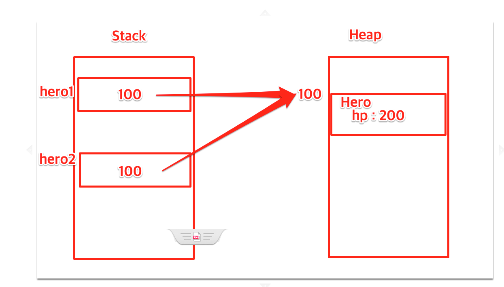

# 클래스

### 레퍼런스 타입과 참조

- 최신 언어는 대부분 타입이 레퍼런스 타입이다

| 실행 중 메모리 할당 | 힙(heap) | 인스턴스 |
| --- | --- | --- |
|  | 스택(stack) | 인스턴스가 들어있는 메모리 주소 |

- 런타임에 힙(heap)에 동적 할당 된다



- dart는 모든 타입이 (prefernce) 참조형으로 작동한다 (신경 안 써도 되게 만들어짐)

## 클래스 필드

- **런타임 상수 값을 필드에 const한 값으로 넣을 수 없다**
- **클래스의 상수 필드는 const 사용이 불가능하다**
    - **언제 인스턴스화해서 사용할지 모르는데 컴파일 타임에 상수를 메모리에 올린다는 건 말이 안 된다**
- **const 값으로 넣어 주기 위해서는 static을 사용함으로서 클래스와 별도의 const값으로 만들어야 한다.**

```dart
final int maxHp = 50;
int hp;

hp = maxHp; // 불가

// 생성자에서는 가능 (런타임)
Cleric(this.hp) {
	hp = maxHp;
}
```

- new 가 없는 애들은 이미 값이 정해져 있는 애들이라 컴파일 타임 상수가 가능하다
- 그래서 인스턴스는 인스턴스화, 런타임에만 생성 가능해서 final만 가능하고 const가 불가능하다

## 생성자

- 생성자는 아래처럼 작성하자
- 중괄호 안에서 Null을 허용하지 않으면 required를 붙여야 한다 (아니면 초깃값으로 초기화하던가)
    - required는 초깃값이 없기 때문에 인스턴스화 시에 값을 넣어주지 않으면 인스턴스화가 불가능
- 필수 parameter와 named parameter를 동시에 사용할 경우 필수 parameter 앞에 와야 한다

```dart
// 모두 필수 parameter
Hero(this.name, this.hp, this.mp);

// name만 필수
Hero(this.name, {this.hp = 50, this.mp = 10});
// 모두 named parameter이지만 name은 Null을 허용 안함
Hero({required this.name, this.hp = 50, this.mp = 10});

// name, hp가 필수
Hero(this.name, this.hp, {this.mp = 10});
// 모두 named parameter이지만 name, hp는 Null 허용 안함
Hero({required this.name, required this.hp, this.mp = 10});
```

## named parameter

- 중괄호 { } 를 넣으면 인스턴스화 시에 파라미터 앞에 이름을 명시해야 한다
    
    ```dart
    Hero hero = Hero(name: '홍길동', hp: 50, mp: 10); // named parameter인 경우 (베스트)
    
    Hero hero = Hero('홍길동', 50); // 일반
    
    Hero hero = hero(10, 4, 6, 4 .... ); // 알아보기 힘들어서 별로다
    ```
    

## static

- static이 붙는 순간 클래스의 필드에 속하지 않게 된다 ( 클래스, 인스턴스와 아무 관계가 없다 )
- 메소드도 마찬가지다 (정적이지 않은 메소드, 필드 이용 불가능)
- 메모리상으로는 클래스와는 다른 곳에 있기 때문이다 ( 독자적으로 관리된다 )
- 언어마다 조금씩 차이가 있으니 주의하자

```dart
int money = 100; // 탑레벨에 선언하면 (static int money = 100)과 동일한 역할을 한다

class Hero {
	// 무관계
	static int money = 100;
	
	// 아직 실체화 되지 않은 부분
	String name;
	int hp;
	
	Hero(this.name, this.hp, this.mp);
	
	static void setRandomMoney() {
		// name 사용 불가
		print(name); // 정적이지 않은 메소드, 필드 이용 불가능
	}
}
```
### const

- 런타임에 메모리에 올릴 때 사용

### **static const**

- **생성자에서 { }를 사용하여 named parameter가 되면 암묵적인 기본값이 null이 되기 때문에 required를 사용하거나 초깃값을 지정해서 초기화해주어야 하는데 이 과정에서  파라미터에는 const 값만 허용해서 보통의 클래스 내부에는 일반 const 값은 들어올 수 없기 때문에 클래스 안에서 선언하더라도 클래스와 무관계한 static const를 사용할 수 있다**

```dart
// 예시
class Cleric {
  static const int maxHp = 50;
  static const int maxMp = 10;

  String name;
  int hp;
  int mp;

  Cleric(this.name, {this.hp = maxHp, this.mp = maxMp});
}
```

## 코드 작성 팁

- 매직 넘버를 상수로 선언해서 줄이는 게 좋다 ( 사용처를 명확하게 하자 )

```dart
cleric.mp -= 5;
// 위에는 5 매직 넘버를 사용한다

// 5를 상수로 선언해서 사용하자 (사용처를 명확하게 하자)
final int selfAidMp = 5;
```

- 테스트 할 때 테스트 범위를 정하자 (범위 산출)
- 함수, 메소드에서 중간 return은 자제하자

## 정리

### 레퍼런스 타입의 참조

- 레퍼런스 타입 변수의 안에는 “인스턴의 정보가 담겨있는 메모리 번지”가 들어 있다
- 어떤 레퍼런스 타입 변수를 다른 변수에 대입하면, 주소만 복사 된다
- 레퍼런스 타입은 필드나 메소드의 인수, 리턴 값의 형으로서도 사용된다

### 생성자

- “클래스명과 동일 명칭으로, 리턴 값의 타입이 명시되어 있지 않은 메소드”는 생성자로 사용된다
- 생성자는 new에 의한 인스턴스화의 직후에 자동적으로 실행 된다 (Dart에서는 new 생략 가능)
- 인수를 가지는 생성자를 정의하면, new를 할 때에 인수를 지정하여 생성자를 실행할 수 있다
- 생성자는 오버로드에 의한 복수 정의가 된다
- 클래스에 생성자 정의가 1개도 없는 경우에 한해, 컴파일러가 “인수 없음, 처리 내용 없음”의 기본 생성자를 자동 정의 해 준다

### 정적 멤버

- static 키워드가 붙어 있는 정적 멤버(필드 또는 메소드) 는
    1. 각 인스턴스가 아닌, 클래스에 실체가 준비된다
    2. 인스턴스를 1개도 생성하지 않아도 이용 가능
- 정적 메소드는 그 내부에 정적이지 않은 메소드나 필드를 이용하는 것이 불가능 하다